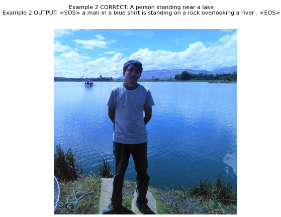

<h2 align="center">
<p>Image Caption Generation 🖼️</p>
</h2>

 TODO:
- ✅ Implementación en Pytorch
- ⬜️ Integración con Captum para interpretabilidad del modelo
- ⬜️ Añadir mecanismos de atención

## ℹ️ Introducción
La *generación de subtítulos en imágenes* es un problema muy conocido de Deep Learning en la que muchos investigadores de las áreas de NLP y CV se han visto involucrados desde mucho antes que surgiesen arquitecturas novedosas como los Transfomers o las GAN's. 

En este repositorio se presenta una implementación basada CNN's y LSTM's. Mejoras adicionales serían la inclusión de mecanismos de atención como en el [paper](https://arxiv.org/abs/1502.03044) de Bengio et al. publicado en 2015 que ha sido el punto partida para la inclusión de Transformers en este tipo de problema.

## 🧠 Modelo

La implementación del modelo que se presenta en este repositorio ha sido modificada a partir de [este](https://github.com/yunjey/pytorch-tutorial/tree/master/tutorials/03-advanced/image_captioning) otro repositorio. Sin embargo, todavía se requiere un hardware relativamente potente y bastante paciencia para el entrenamiento. La arquitectura consta de un *Encoder CNN* construido apartir del modelo preentrenado *Inception v3*, y de un *Decoder LSTM* que será la encargada de interpretar las carácteristicas visuales obtenidas por el Encoder y así generar una descripión de la imagen en cuestión.  

A continuación se muestran más detalles de la arquitectura:

<p align="center">
  
</p>

Si desea analizar la arquitectura más a fondo, siéntase libre de editar el [modelo](model.py).

## 📁 Dataset

Se uso un dataset de Kaggle llamado ["Flickr8k-Images-Captions"](https://www.kaggle.com/dataset/e1cd22253a9b23b073794872bf565648ddbe4f17e7fa9e74766ad3707141adeb), el cual contiene diversas imágenes acompañadas de una breve descripción contextual escrita. El archivo pesa aproximadamente 1GB. Descomprímalo en la carpeta `data`.

Siéntase libre de usar *COCO* u otro tipo de dataset que contexta una descripción contextual.

## ▶ Demo
Instale las dependencias del archivo `requirements.txt` con el siguiente comando:
```bash
pip install -r requirements.txt --no-cache-dir
```

Para poder entrenar el modelo, ejecute el siguiente comando:

```bash
python train.py
```
Para visualizar cómo disminuye la pérdida, ejecute **Tensorboard**:
```bash
tensorboard --logdir "./"
```

Finalizada cada época, se mostrará un resultado gráfico. A continuación se muestra la prueba en dos imágenes después de 8 épocas (aproximadamente 2.5 horas de entrenamiento en una 1050Ti).
<p align="center">Resultado 1</p>
<p align="center">

</p>

<p align="center">Resultado 2</p>
<p align="center">

</p>

Como se puede observar, si bien no acierta en el primer ejemplo, en el segundo ejemplo si se logra dar una aproximación regularmente buena (*un hombre con una camisa azul está de pie sobre una roca con vistas a un río*). Si desea obtener mejores resultados, entrene por más épocas y tenga mucha paciencia :)! 