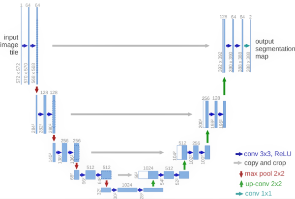
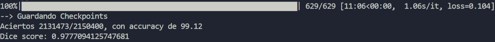
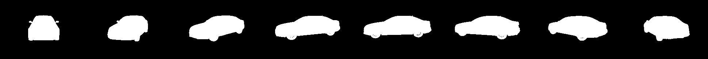
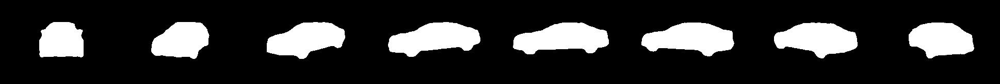
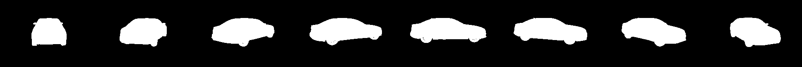

<h2 align="center">
<p>Segmentación de imágenes con UNET</p>
</h2>

## ℹ️ Segmentación
La segmentación de imágenes es un problema muy popular de visión por computadora que abarca desde campos de la medicina (localización de la zona afectada), hasta la conducción autónoma. En la siguiente animación se muestra la segmentación *semántica* para diversos objetos (segmentación no binaria).
<p align="center">
  
</p>

Para lograrlo se han inventado muchas arquitecturas, entre las que destacan Mask-RCNN o UNET. Trataremos más a fondo la última, que fue presentada en [este paper](https://arxiv.org/abs/1505.04597) con propósitos inicialmente médicos, pero también ha demostrado buen desempeño en una diversidad de otras tareas.

## 🧠 Modelo

La implementación del modelo que presentamos en este repositorio ha sido levemente modificada para poder ser entrenada más rapidamente (debido a que se requiere un hardware relativamente potente). Se siguió en la medida de lo posible los lineamientos del paper original. 

A continuación se muestra la arquitectura de forma gráfica:

<p align="center">
  
</p>

La arquitectura contiene dos piezas clave:
- **DoubleConv**: Clase que se encarga de hacer las dos convolucionales sucesivas (en un mismo nivel), como puede observar en la imagen (flechas azules). Usaremos esa clase para poder construir la parte *descendente* y *ascendente* de la UNET.
- **skip_connections**: Conexiones residuales que evitan la degradación de la información que pasa por el cuello de botella (parte más inferior). En código, se representa mediante una concatenación de tensores (asegúrese que las dimensiones coincidan).

El modelo se ha modificado para poder hacer segmentación binaria, pintando de blanco y negro la imagen resultante. Si desea hacer una segmentación con más categorías, puede cambiar el número de canales de salida y la función de coste (inicialmente se usa una Binary Cross Entropy).

Si desea analizar la arquitectura más a fondo, siéntase libre de editar el [modelo](model.py).

## 📁 Dataset

Como los datos para entrenar esta arquitectura son difíciles de conseguir y/o de etiquetar manualmente, se ha recurrido a Kaggle. El [Dataset Kaggle "Carvana Image Masking"](https://www.kaggle.com/c/carvana-image-masking-challenge/data?select=train.zip) cuenta con imágenes de coches con su correspondiente máscara de segmentación. El dataset completo pesa 27GB pero solo se han descargado los archivos *train.zip* y *train_masks.zip*. Asegúrese de colocar los datos en las siguientes carpetas:
- *train_masks* y *train_masks*, con un 95% de los datos datos totales.
- *val_masks* y *val_masks*, con un 5% de los datos datos totales.


## ▶ Demo
Instale las dependencias del archivo `requirements.txt`.

Para poder entrenar el modelo, ejecute el siguiente comando:

```bash
python train.py
```

En el terminal, después de 1 época se mostrará algo como:

<p align="center">
  <p align="center" >Accuracy después de 1 época</p>
  
</p>

Se observa que los resultados son prometedores y con un accuracy muy aceptable.
En caso tenga un desbordamiento de memoria *cuda*, reduzca el tamaño de lote (hiperparámetro *BATCH_SIZE*).

A continuación se muestran dos predicciones hechas por el modelo:

<p align="center">
  <p align="center">Original 1</p>
  
  <p align="center">Predicción 1</p>
  
</p>

<p align="center">
  <p align="center">Original 2</p>
  
  <p align="center">Predicción 2</p>
  
</p>