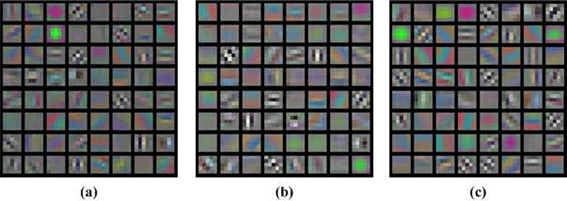
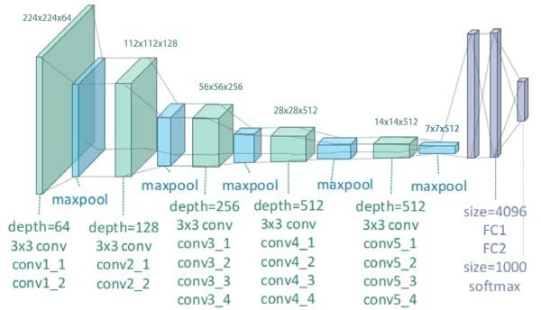
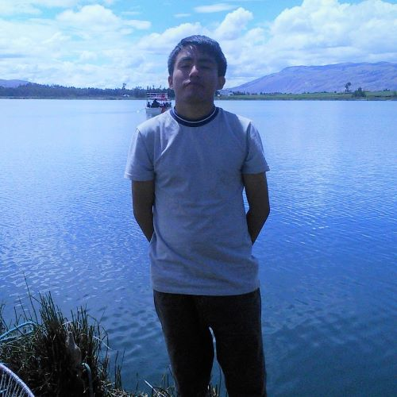
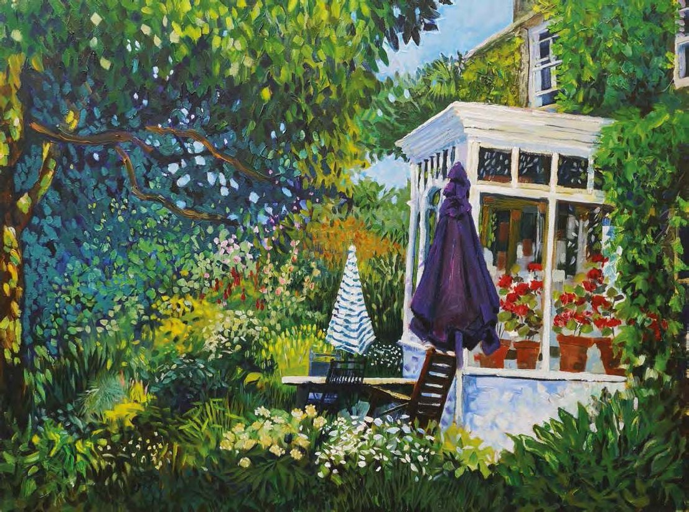
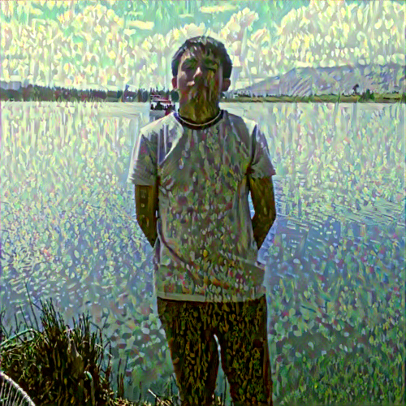

<h2 align="center">
<p>Transferencia de estilo con VGG 🖼️</p>
</h2>

## ℹ️ Introducción
En la transferencia de estilo hay dos imágenes que se utilizan como entrada: la imagen de contenido y la imagen de estilo. A partir de estos, se crea una tercera imagen, llamada imagen generada. Esto es gracias a los kernels de las CNN's, que pueden aprender una representación del mapa de características de la imagen; es decir, sus características y patrones más relevantes. Al pasar de capas superficiales a capas profundas, la red neuronal convolucional puede detectar patrones complejos, lo que puede no tener mucho sentido para el ojo humano.

<p align="center">
  
</p>

Estas representaciones son la clave para la transferencia de estilos. Se utilizan para calcular la distancia de la imagen generada desde las imágenes de estilo y contenido. Tenemos que asegurarnos de que la imagen generada conserva el contenido de la imagen de contenido y que el estilo es similar a la imagen de estilo. Es decir: la transferencia de estilo es un problema de optimización en el que tenemos que minimizar 3 funciones de pérdida: una para la pérdida de contenido, otra para la pérdida de estilo y otra llamada pérdida total.

En este repositorio se presenta una implementación basada en VGG19, siguiendo los lineamientos del paper ["A Neural Algorithm of Artistic Style"](https://arxiv.org/abs/1508.06576) publicado en 2015.

## 🧠 Modelo base

El modelo base es VGG19, usaremos las siguientes capas (por índice): '0', '5', '10', '19' y '28'. Dichas capas seleccionadas son capas convolucionales, que serán las únicas piezas que extrearemos del modelo base (más concretamente, las características que generan). Podemos usar una imagen clon inicial como entrada al modelo base, o también podría ser un tensor aleatorio (hay mejores resultados como lo primero).

A continuación se muestra la arquitectura VGG19:

<p align="center">
  
</p>

Si desea analizar la arquitectura más a fondo, siéntase libre de editar el [modelo](model.py).

## ▶ Demo
Instale las dependencias del archivo `requirements.txt` con el siguiente comando:
```bash
pip install -r requirements.txt --no-cache-dir
```

Para poder entrenar el modelo, ejecute el siguiente comando:

```bash
python train.py
```

Cada 200 iteraciones, la imagen resultado será almacenada. A continuación se muestra el resultado para 1000 iteraciones.
<p align="center">Imagen fuente</p>
<p align="center">

</p>

<p align="center">Imagen estilo</p>
<p align="center">

</p>

<p align="center">Imagen resultado</p>
<p align="center">

</p>

Lo resultados podrían mejorar si juegan con los hiperparámetros.