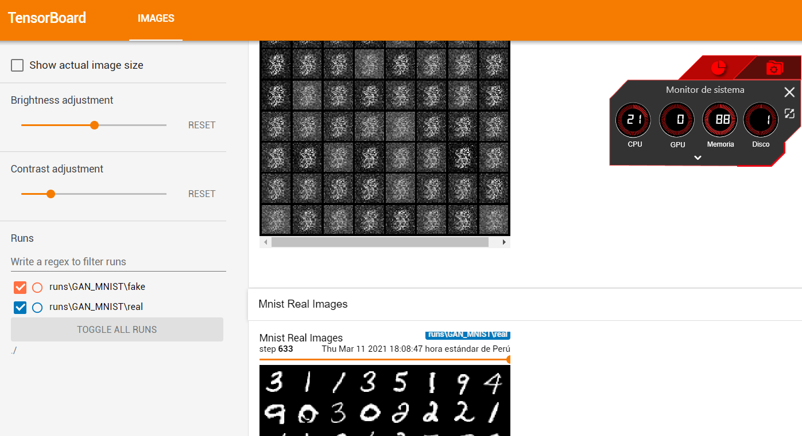

<h2 align="center">
<p>Tu primera GAN 🔥</p>
</h2>

## 🧠 Modelo
La arquitectura del generador y discriminador, son redes densas (aún no usamos capas convolucionales). 
El dataset usado son los dígitos MNIST. Tenga cuidado al escoger sus hiperparámetros para el momento del entrenamiento, debido a que esta GAN es muy sensible.

A continuación se muestra la arquitectura del generador:

```python
class Generator(nn.Module):
    def __init__(self, z_dim, img_dim):
        super().__init__()
        self.gen = nn.Sequential(
            nn.Linear(z_dim, 256),
            nn.LeakyReLU(0.1),
            nn.Linear(256, img_dim),
            nn.Tanh(),
        )

    def forward(self, x):
        return self.gen(x)
```

También se muestra la arquitectura del discriminador:
```python
class Discriminator(nn.Module):
    def __init__(self, img_dim):
        super().__init__()
        self.disc = nn.Sequential(
            nn.Linear(img_dim, 128),
            nn.LeakyReLU(0.1),
            nn.Linear(128, 1),
            nn.Sigmoid(),
        )

    def forward(self, x):
        return self.disc(x)
```
Puede hacer las mejoras que desea.


## ▶ Demo

Para poder entrenar el modelo, ejecute el siguiente comando:

```bash
python gan.py
```

Para visualizar cómo se van generando los números, ejecute **Tensorboard**:
```bash
tensorboard --logdir "./"
```
En su navegador se mostrará algo como:

<p align="center">
  
</p>