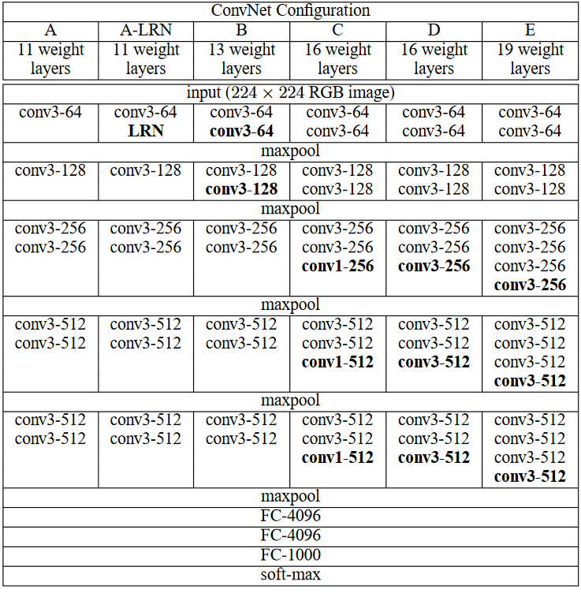
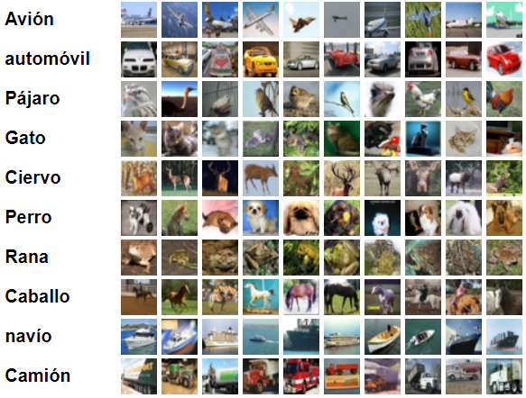

<h2 align="center">
<p>Red Convolucional VGG</p>
</h2>

 TODO:
- ✅ Implementación en Pytorch
- ⬜️ Serializar el modelo entrenado

## ℹ️ Introducción
El ImageNet Large Scale Visual Recognition Challenge (ILSVRC) es una competencia anual de visión por computadora. Cada año, los equipos compiten en dos tareas. El primero es detectar objetos dentro de una imagen que provienen de 200 clases, lo que se denomina localización de objetos. El segundo es clasificar las imágenes, cada una etiquetada con una de las 1000 categorías, lo que se denomina clasificación de imágenes. VGG 16 fue propuesto por Karen Simonyan y Andrew Zisserman del Laboratorio del Grupo de Geometría Visual de la Universidad de Oxford en 2014 en el paper ["VERY DEEP CONVOLUTIONAL NETWORKS FOR LARGE-SCALE IMAGE RECOGNITION"](https://arxiv.org/abs/1409.1556). Este modelo ganó el 1er y 2do lugar en las categorías anteriores en el desafío ILSVRC 2014.

Este modelo alcanza una precisión de prueba del 92,7% top-5 en el conjunto de datos ImageNet que contiene 14 millones de imágenes que pertenecen a 1000 clases.

## 🧠 Modelo

VGG es una arquitectura de red neuronal convolucional clásica. Se basó en un análisis de cómo aumentar la profundidad de dichas redes. La red utiliza pequeños filtros de 3 x 3. La red se caracteriza por su simplicidad: los únicos otros componentes son capas pooling y una capa completamente conectada.

A continuación se muestran más detalles de la arquitectura:

<p align="center">
  
</p>
<p align="center">
  
</p>

Si desea analizar la arquitectura más a fondo, siéntase libre de editar el [modelo](model.py).

## 📁 Dataset

El dataset usado fue CIFAR10, consta de 60000 imágenes en color, resolución 32x32 y agrupada en 10 clases, con 6000 imágenes por clase.

A continuación se muestran las categorías disponibles:

<p align="center">
  
</p>

## ⚡ Entrenamiento
<p align="center">
  
</p>

Instale las dependencias del archivo `requirements.txt` con el siguiente comando:
```bash
pip install -r requirements.txt --no-cache-dir
```
Hay algunos detalles que usted debe conocer antes de entrenar:
- Para entrenar sin dificultades necesita un GPU Nvidia con 8GB-16GB de memoria. Yo lo entrene en una 1050Ti y tuve constantes desbordamiento de memoria CUDA (La resolución 224x224 de la imágenes suele ser el problema). Para solucionar dicho problema, tuve que disminuir el número de neuronas en las capas densas, disminuir el tamaño de lote y disminuir tamaño de las imágenes de entrada. 
- Hay un sesgo introducido en el dataset CIFAR10 que pude observar, y es que al momento de hacer un resize de 32x32 a 224x224, la imagen es muy pobre visualmente. Una solución podría ser usar un dataset con resoluciones cercanas a 224x224. Una solución temporal sería disminuir tamaño de las imágenes de entrada, como mencioné en el punto anterior. 
-La selección de la tasa de aprendizaje afectará bastante a la convergencia del modelo. El *lr* que elegí da señales de convergencia (tasas más grandes llevan a un *loss* que no baja del 2.3).

Para poder entrenar el modelo, ejecute el siguiente comando:

```bash
python train.py
```

Para visualizar cómo disminuye la pérdida, ejecute **Tensorboard**:
```bash
tensorboard --logdir "./"
```

También he añadido una [variante](train_lightning.py) de [*train.py*](train.py), usando Pytorch Lightning, para poder entrenar el modelo de forma más eficiente. Ejecute el siguiente comando:
```bash
python train_lightning.py
```
