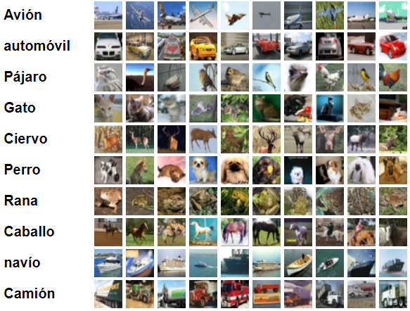
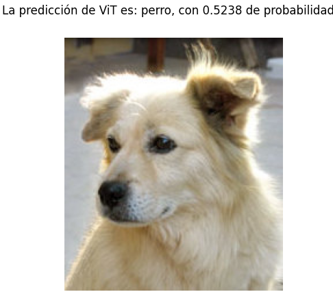

<h2 align="center">
<p>Vision Transfomer 🤖</p>
</h2>

## 🆕 Actualización
- 16/03/21: Soporte para Tensorflow 2.3 y 2.4 (Multi-head attention no esta disponible en TF 2.3 de manera nativa). Implementación basada de [Khalid Salama](https://www.linkedin.com/in/khalid-salama-24403144/).

 TODO:
- ✅ Implementación en Tensorflow
- ⬜️ Integración con Captum
- ⬜️ Implementación en Pytorch
- ⬜️ Serialización del modelo (despliegue)

## ℹ️ Introducción
Si bien la arquitectura Transformer se ha convertido en el estándar de facto para tareas de procesamiento del lenguaje, sus aplicaciones en visión por computadora siguen siendo limitadas.  En visión, los métodos de atención se aplican en conjunto con redes convolucionales, o son utilizados para reemplazar ciertas componentes de las redes convolucionales manteniendo la estructura general en su lugar.  

En este repositorio se presenta una implementación de la arquitectura [Vision Transfomer](https://arxiv.org/abs/2010.11929) que demuestra independencia de las CNN en tareas de visión, y usando solamente Transformers,  aplicados directamente a secuencias de parches de una imagen, puede realizar muy bien varias tareas de clasificación de imágenes. Vision Transformer (ViT) logra excelentes resultados en comparación con las redes convolucionales de última generación, al tiempo que requieren sustancialmente menos recursos computacionales para entrenarse.

La investigación de Vision Transformer se suma a la de muchos otros pioneros en el campo de NLP&CV, por mencionar algunos como DERT o DeiT. Si desea analizar el paper original en español, consulte [este](src/ViT_resumen.pdf) documento que logre traducir y extender con algunas técnicas de explicabilidad que próximamente contarán con su respectiva implementación (posiblemente usando [Captum](https://captum.ai/)).


## 🧠 Modelo

La implementación del modelo que se presenta en este repositorio ha sido levemente modificada para poder ser entrenada más rapidamente (debido a que se requiere un hardware relativamente potente). Se siguió en la medida de lo posible los lineamientos del paper original. 

A continuación se muestra el funcionamiento de la arquitectura:

<p align="center">
  
</p>

La arquitectura contiene dos piezas clave:
- **Embeddings de entrada**: Es una concatenación de dos embeddings, un embedding posicional que brindará la posición relativa de un parche respecto a la imagen completa, y un embedding proyección que reduce la longitud de entrada hacia el bloque Transfomer para poder acelerar el cómputo. Una longitud de entrada mayor, requiere más cómputo.
- **MLP head**: Es una red densa normal, que se encargará de procesar la salida del Transformer y poder realizar la clasificación de manera más sencilla (haciendo uso de la representación espacial obtenida por el Transformer).

Si desea analizar la arquitectura más a fondo, siéntase libre de editar el [modelo](model.py).

## 📁 Dataset

El dataset usado fue CIFAR10, consta de 60000 imágenes en color, resolución 32x32 y agrupada en 10 clases, con 6000 imágenes por clase.

A continuación se muestran las categorías disponibles:

<p align="center">
  
</p>

Siéntase libre de usar *CIFAR100* u otro tipo de dataset.

## ▶ Demo
Instale las dependencias del archivo `requirements.txt` con el siguiente comando:
```bash
pip install -r requirements.txt --no-cache-dir
```

Para verificar la integridad de las componentes del modelo, ejecute el siguiente comando:
```bash
python model.py
```
Inmediatamente, usted observará las siguientes imágenes:
<p align="center">Original</p>
<p align="center">

</p>

<p align="center">Parches de imagen (input del modelo)</p>
<p align="center">

</p>


Para poder entrenar el modelo, ejecute el siguiente comando:

```bash
python train.py
```

Después de 10 épocas (1 hora aproximadamente con la GPU a tope), se consiguió un accuracy de aproximadamente 62.62% y un top 5 accuracy de aproximadamente 96.47% en el dataset de CIFAR10. Si desea un mayor performance, elija un dataset mucho más grande (Imagenet o CIFAR100) y aumente considerablemente el número de épocas.

Para poder hacer una predicción con el modelo entrenado, ejecute el siguiente comando:

```bash
python test.py
```
Se mostrará la siguiente ventana:
<p align="center">
  
</p>
